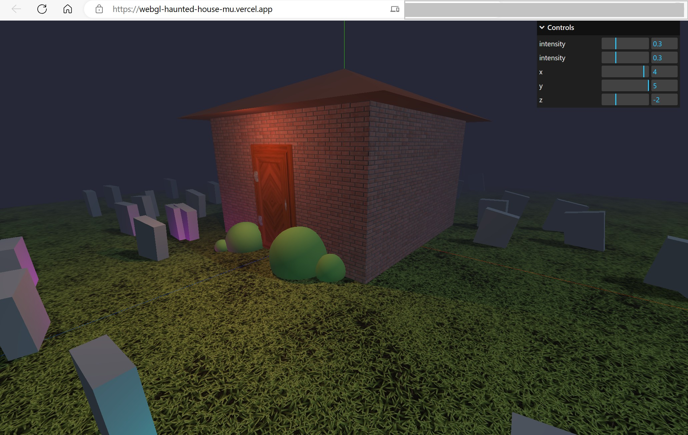

## webgl-haunted-house
use native geometries to create a scene including house, bushes, graves,and ghosts(light)

## 预览
https://webgl-haunted-house-mu.vercel.app/




## Setup
Download [Node.js](https://nodejs.org/en/download/).
Run this followed commands:

``` bash
# Install dependencies (only the first time)
npm install

# Run the local server at localhost:8080
npm run dev

# Build for production in the dist/ directory
npm run build
```
